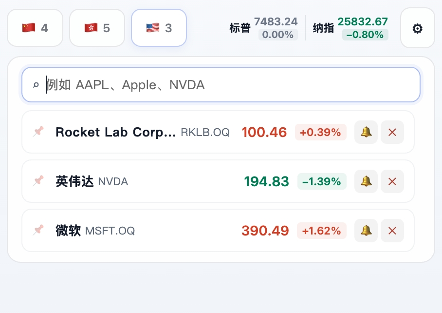
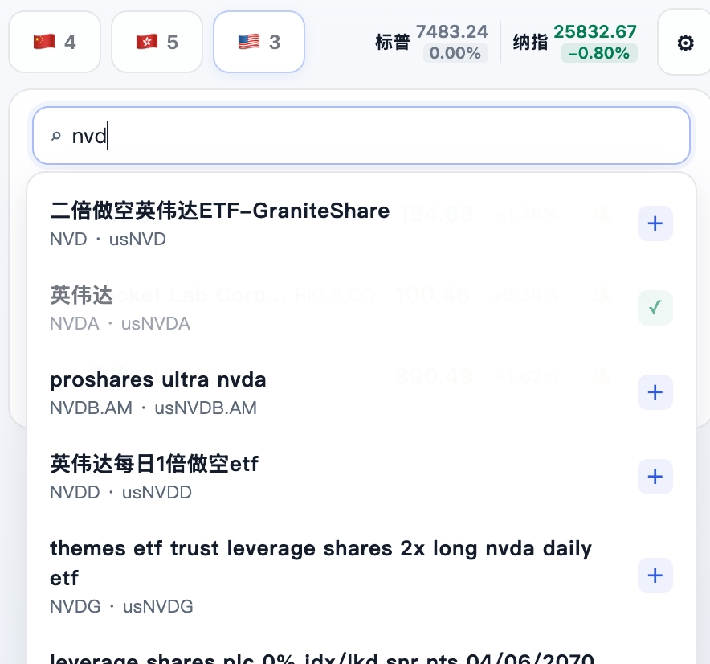
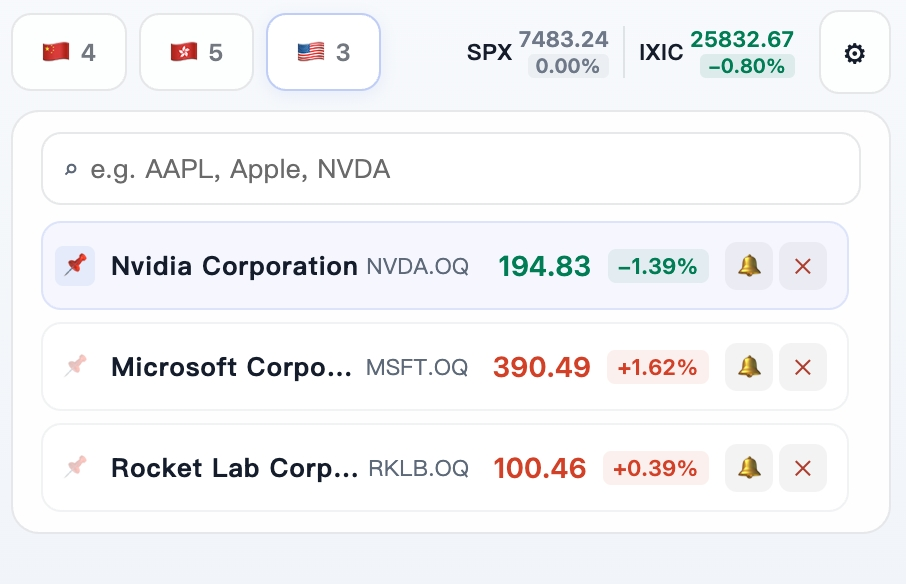

# Chrome Stock Monitor

**[中文文档](./README.md)**

A lightweight Chrome extension for real-time A-share, HK, and US stock monitoring with custom alerts.

No signup, no backend — install and go.

## Features

- **Three Markets**: A-Share, HK, and US stocks in separate tabs
- **Real-Time Quotes**: Live price, change, and % change with red/green coloring
- **Smart Search**: Search by code, name, or pinyin — full-market search including BSE and ETFs
- **Auto Refresh**: Runs in the background with configurable 1–30 second intervals
- **Change Alerts**: Set a % threshold — get notified when exceeded
- **Price Alerts**: Set a target price with direction (≥ / ≤) — get notified on hit
- **Badge Alerts**: Triggered stock count shown directly on the extension icon
- **Drag & Drop Reorder**: Hold the stock name area to drag and reorder
- **Pin Stocks**: 📌 button to pin important stocks to the top
- **Bilingual**: HK/US stock names switch to English automatically in English mode

## Install

```bash
git clone https://github.com/makersy/chrome-stock-monitor.git
```

1. Open Chrome and go to `chrome://extensions/`
2. Enable **Developer mode** (top-right toggle)
3. Click **Load unpacked** and select the project folder
4. Pin the extension to the toolbar

## Usage

1. Click the extension icon to open the popup
2. Switch markets using the top tabs (A-Share / HK / US)
3. Search by stock code or name, then click to add
4. Tap 🔔 to set a change threshold or target price
5. Tap ⚙ to open settings and configure auto-refresh and alerts
6. Hold the stock name area to drag and reorder

## Data Sources

Quote data comes from Tencent quote APIs and Eastmoney search APIs — all public and free. The extension does not collect or upload any user data.

## Screenshots







## License

No specific license. Use freely.
